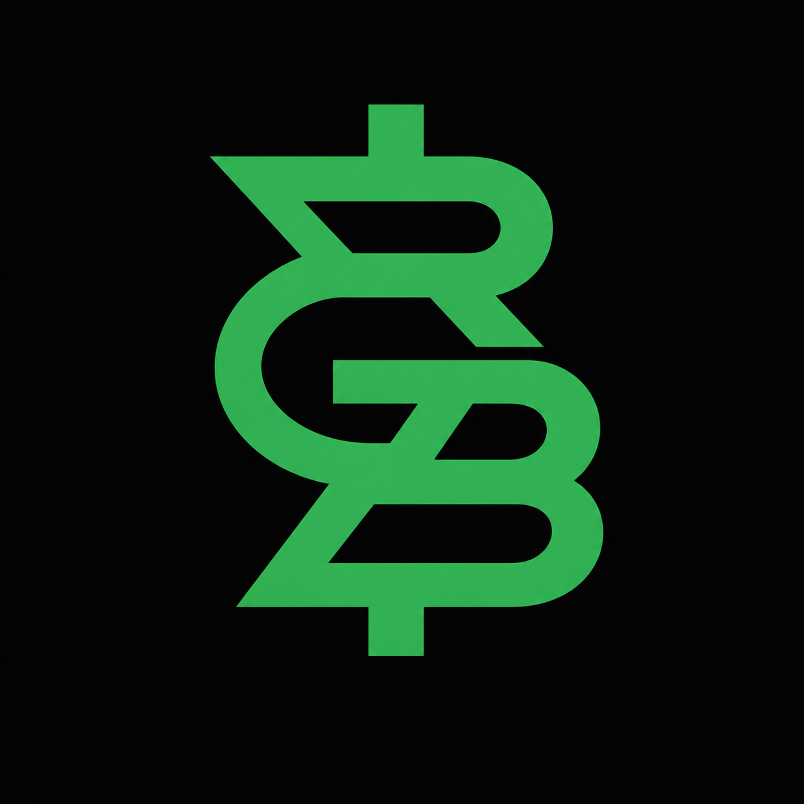

<p align="center">
  
</p>

<h1 align="center">RGB Investing</h1>

<p align="center">
  <a href="http://178.104.125.39:5175">🌐 Live Demo</a>
  <br />
  S&P 500 · NASDAQ 100 · BIST 100
  <br />
  Deep learning based BUY/SELL signal generator for stock markets.
  <br />
  Converts market data into visual patterns and learns technical indicator combinations automatically.
</p>

<p align="center">
  
  
  
  
  
  
  
  
  
</p>

---

## Overview

**RGB Investing takes a different approach to technical analysis.** 

Technical indicators play a very important role in investing. However, the technical indicator that works best varies from one stock to another and from one global market to another. Generally, people interested in the stock market try to overcome this challenge by watching YouTube videos from all kinds of investors and seeking information from forums. In the end, they usually apply a fixed set of 3–5 rules to every stock.


* **The model learns, on a stock-by-stock basis, which indicators work across hundreds of stocks and three different markets.** 

  - If you had blindly bought every stock over the past 10 years, you would have been correct about one-third of the time. The model aims to significantly increase this rate by learning patterns from historical data.


**The core idea**

Convert the last 400 trading days of OHLCV data into 16 independent technical indicators, reshape them into a 20×20 grid (treating it like an image), and train a CNN to recognize patterns that historically preceded significant price movements.


* **Signals are generated weekly (every Friday after market close) and updated monthly via automated retraining.**


---

## Architecture

```
User (Browser)
      |
ASP.NET Razor Pages (Web UI)
      |
FastAPI (Python ML API)
      |
      +-- TensorFlow CNN Model
      +-- Redis Cache
      +-- MLflow (Experiment Tracking)
      |
SQLite (Users, Portfolio, Predictions)
      |
Apache Airflow (Docker, LocalExecutor)
      +-- weekly_predict_bist100    (Fri 15:00 UTC)
      +-- weekly_predict_us         (Fri 21:00 UTC)
      +-- weekly_drift_monitor      (Fri 22:00 UTC)
      +-- monthly_optuna_retrain    (1st of month, 16:00 UTC)
```

---

## Model

```
Input (20×20×16)
  → TimeDistributed(Dense(3))     # Learned RGB projection
  → Conv2D(32) + BN + SE-block    # dilation (1,1)
  → Conv2D(64) + BN + SE-block    # dilation (2,1)
  → MaxPool(2,2)
  → Conv2D(64) + BN + SE-block    # dilation (4,1)
  → MaxPool(2,2)
  → GlobalAveragePooling2D
  → Dropout(0.5)
  → Dense(1, sigmoid)
```

**Training strategy:** Global model trained on SP500 (500+ stocks), then fine-tuned per market using only the projection and output layers (113 trainable parameters). This preserves universal pattern knowledge while adapting to market-specific dynamics.

**Hyperparameter optimization:** Optuna runs monthly. Before each search, the label threshold range is dynamically computed from the last 12 months of market data, ensuring the search space reflects current market conditions. Optuna then finds the optimal threshold within this range. 

* Label threshold defines the minimum expected return for a BUY signal: 
  - For example, a threshold of 3% means the model marks a stock as BUY only when it expects at least 3% gain in 5 trading days. This value is optimized separately for each market.

**Indicators:**

* The 16 indicators were selected to be independent of one another. Using indicators that are highly correlated with one another does not add any additional information to the model; it merely increases noise.

| Category | Indicators |
|---|---|
| Raw | log_return, volatility, volume_ratio |
| Momentum | rsi_14, stoch, mfi, cci, roc |
| Trend | macd, macd_signal, adx, vwap_ratio |
| Volatility | bb_pct, bb_width, atr |
| Volume | obv_ratio |

---

## Tech Stack

| Layer | Technology |
|---|---|
| Web UI | ASP.NET Razor Pages (.NET 10) |
| ML API | FastAPI + Uvicorn |
| Model | TensorFlow / Keras CNN |
| Data | yfinance |
| Cache | Redis 7 |
| Database | SQLite |
| Experiment Tracking | MLflow |
| Hyperparameter Search | Optuna |
| Scheduler | Apache Airflow 2.7 (Docker, LocalExecutor) |
| Auth | ASP.NET Identity |
| Stock Search | Finnhub API |

---

## Airflow DAGs

| DAG | Schedule | Description |
|---|---|---|
| `weekly_predict_bist100` | Fri 15:00 UTC | Update BIST100 signal cache + save predictions |
| `weekly_predict_us` | Fri 21:00 UTC | Update SP500 + NASDAQ100 cache + save predictions |
| `weekly_drift_monitor` | Fri 22:00 UTC | Evaluate past predictions, detect model drift |
| `monthly_optuna_retrain` | 1st of month 16:00 UTC | Dynamic threshold computation + Optuna search + retrain all markets |

---

## Project Structure

```
.
├── api/                    # FastAPI application
│   ├── main.py             # Endpoints
│   ├── predictor.py        # Model inference + Grad-CAM
│   ├── cache.py            # Redis cache layer
│   └── schemas.py          # Pydantic models
├── src/                    # Core ML pipeline
│   ├── data.py             # yfinance data fetching
│   ├── features.py         # 16 technical indicators
│   ├── normalization.py    # QuantileScaler
│   ├── builder.py          # Experiment builder
│   ├── model.py            # CNN architecture
│   ├── experiment.py       # Training orchestration
│   ├── dataset.py          # Sliding window dataset
│   ├── optimize.py         # Optuna search + dynamic threshold
│   ├── tickers.py          # Market ticker lists
│   └── experiment_config.py
├── dags/                   # Airflow DAGs
│   ├── daily_predict_dag.py
│   ├── drift_monitor_dag.py
│   └── optuna_dag.py
├── RgbFinanceWeb/          # ASP.NET web application
│   ├── Pages/              # Razor Pages
│   ├── Data/               # EF Core DbContext
│   ├── Models/             # View models
│   └── Endpoints/          # Minimal API endpoints
├── config.py               # Project configuration
├── airflow-official.yaml   # Airflow Docker Compose
└── docker-compose-redis.yml
```

---

## API Reference

Base URL: `http://localhost:8000`

| Method | Endpoint | Description |
|---|---|---|
| GET | `/health` | Model status |
| GET | `/signals?market=SP500` | All signals for a market |
| GET | `/signals/{ticker}?market=SP500` | Signal for a specific ticker |
| GET | `/threshold?market=SP500` | Expected return threshold for a market |
| GET | `/gradcam/{ticker}?market=SP500` | Grad-CAM heatmap (PNG) |
| GET | `/weights_json?market=SP500` | Learned projection weights |
| GET | `/indicators/{market}` | Indicator importance ranking |
| GET | `/model/history/{market}` | Training run history |
| POST | `/train` | Trigger model training |
| GET | `/train/{job_id}` | Training job status |
| POST | `/predictions/save?market=SP500` | Save weekly predictions |

---

